# Bus Tracker — Issue Dependency Graph

> Live preview: https://mermaid.live/view#pako:eNqNVstq3EAQ_JWGOREkPO9Dck0IeA0JzidiY2pGC5Y1YnfBGLK_s7MrYRw5Uq3Xma6q7qqeKfEf5QYTgkNKoCkAhCGHYQY8gBJQ6iL0OIEY0A1QASWCrn6Orx9qz1Lmg9UFEIUH8QIgoQpBYM5GqEsGTSVYBnSBhCrrnFI2JM7FUWKj22gJfMh1mIvn45GQiDZ3JXfFm0AHhr2E0zVxZ9s-rLWg7bCBRNhcANOYtAiLlVFz6QUYR3TucdJzhZQvR2RMX2pEOhtj-9G-1GgIGV07gnIkztq3L8b5QCJ1rBtkPjhHWCqMJXfWFCOLM6TJspTJ8kV2GDJjfHlCFkf9ljHm_fy8sCxEwOxJkq0sKx_3jMUjV3-WjkGXaD7v5vEbu_JLgWTq_Vr11HcEWA6uE59hrRGXAUOSfFPmFiVJTvqP2RmtALQkZm10E9LvFFbSqJYCuAXMJ10b70IU_jSsaXZh2J5HqwT3JPRMQky-S7tPcJRsYyf7FVh5ffrdDy0vRGK8XXYklr4I--yY6lrFnBtASgPJh83qIROR8OPn6sSaI3y12YIkAUhgF8nyy4lI5kOFzn66FhHv3s66iNx2eyH41nNtnjRKTfrKfVSRWDJQKJ1IdaOVJpqHcGJ5K8wFJLQpQMM0YkUub0M0GnkQ4pXz8QmHzYQrS3uX1n7gUTY8xRh1c_KWQeT7nW-sqOyyE_ZbFXUoGNdiyREyHMA5HHY9eGbk3QIf_kvnvk9Xdd0TELmxk_b7LPH_2PTj3Pd3JPRT17RwTCIzFL6Kp6T0bfmln1BQmvThNh-d9CRUxvCSTQOfe-Zy4tKVgBT9TLCidKOWj7Jx8Fn3RASlRfo6NUBRwVdR9HK4rpE7LBVflhITvAFkRxx6uNq8ABxAgBISSHQZ-JTbVPqL4_K6cVdIBtPCzKepEmuXQIJhKNONx4qA2zQmFCmoQMFnFnJoAMeQWQO8LeD9mig7GvJ7IIOqTvCx64l1WwBzAz4v8iYAnz3w4yBiVgAxZ3YFj0P4Djd6YpnPGqRUKsOlJNU-R6whIva9cMq1h5HHyjqsli2rs0NZfF6hUKTz_Wr78R_hwmre

## Dependency Graph

```mermaid
flowchart TD
  subgraph L0["Layer 0 — Foundation (no blockers)"]
    I4["#4 Split MapView.tsx"]
    I5["#5 Enrich /api/vehicles/"]
    I8["#8 Handle stale GTFS feeds"]
    I12["#12 Persist GTFS static to SQLite"]
    I15["#15 Rework arrivals endpoint"]
    I16["#16 CI linting pipeline"]
    I17["#17 Create AGENTS.md"]
    I18["#18 Remove hardcoded CORS"]
    I21["#21 Create .env.example"]
    I23["#23 TS path aliases"]
    I25["#25 Clean up unused hook"]
    I27["#27 Gzip-compressed feeds"]
    I28["#28 Version/release info"]
    I29["#29 Docker healthchecks"]
    I32["#32 Refactor cache layer"]
    I10["#10 Keyboard shortcuts"]
    I24["#24 Architecture doc"]
    I20["#20 Refresh-now button"]
    I6["#6 Loading skeletons / empty states"]
  end

  subgraph L1["Layer 1 — depends on L0"]
    I3["#3 Show all vehicles on map"]
    I7["#7 Debounce map pan"]
    I13["#13 Predicted + scheduled departures"]
    I9["#9 Route browser tab"]
    I14["#14 Enrich health endpoint w/ cache metadata"]
    I33["#33 OpenAPI tags / response models"]
    I26["#26 Evict stale marker icon caches"]
  end

  subgraph L2["Layer 2 — depends on L1"]
    I11["#11 Bus vs LRT markers"]
    I30["#30 Vehicle heading arrows"]
    I31["#31 Trip progress indicator"]
    I19["#19 Animate map transitions"]
    I22["#22 Frontend tests"]
  end

  subgraph L3["Layer 3 — depends on L2"]
    I35["#35 Make stop cards link to route browser"]
    I36["#36 LRT-specific route colors"]
    I37["#37 LRT / bus layer toggle"]
    I38["#38 Filter vehicles by route"]
    I45["#45 Stale feed indicator in UI"]
  end

  I3 --> I11
  I3 --> I30
  I3 --> I26
  I3 --> I31
  I3 --> I38
  I3 --> I35
  I3 --> I45

  I5 --> I3
  I5 --> I9
  I5 --> I11
  I5 --> I36
  I5 --> I37
  I5 --> I38

  I4 --> I7
  I4 --> I19
  I4 --> I22

  I12 --> I13
  I13 --> I31

  I32 --> I14
  I32 --> I26

  I8 --> I41
  I8 --> I34

  I11 --> I36
  I11 --> I37

  classDef high fill:#ef4444,color:#fff,stroke:#b91c1c
  classDef medium fill:#f59e0b,color:#fff,stroke:#b45309
  classDef low fill:#22c55e,color:#fff,stroke:#15803d

  class I3,I4,I5,I8 high
  class I7,I9,I13,I16,I22,I27 medium
  class I6,I10,I11,I14,I15,I17,I18,I19,I20,I21,I23,I24,I25,I26,I28,I29,I30,I31,I32,I33,I35,I36,I37,I38,I45 low
```

## Parallelism Waves

The graph yields **4 waves** where work can be parallelised with no cross-dependency conflicts:

### Wave 0 — Spin up ALL L0 issues in parallel
| Subteam | Issues |
|---------|--------|
| **Backend core** | #5, #8, #12, #15, #27, #32 |
| **Frontend refactor** | #4, #6, #10, #20, #23, #25 |
| **DevOps / tooling** | #16, #18, #21, #28, #29 |
| **Docs** | #17, #24 |

These are fully independent — spawn 4 agents.

### Wave 1 — As soon as any L0 completes
| Trigger | Launch |
|---------|--------|
| #5 done | #3 (show all vehicles), #9 (route browser) |
| #4 done | #7 (debounce pan), #19 (animate transitions) |
| #12 done | #13 (predicted + scheduled) |
| #32 done | #14 (enriched health), #26 (stale marker eviction) |
| #5 + #15 stable | #33 (OpenAPI docs) |

### Wave 2 — As soon as any L1 completes
| Trigger | Launch |
|---------|--------|
| #3 done | #11, #30, #31, #35, #38, #45 |
| #13 done | #31 (trip progress gets predictions) |
| #11 done | #36 (LRT colors), #37 (layer toggle) |
| #3 + #4 stable | #22 (frontend tests) |

### Wave 3 — Polish (starts when L2 wraps)
| Trigger | Launch |
|---------|--------|
| #11 + #36 done | #37 (LRT/bus layer toggle) |
